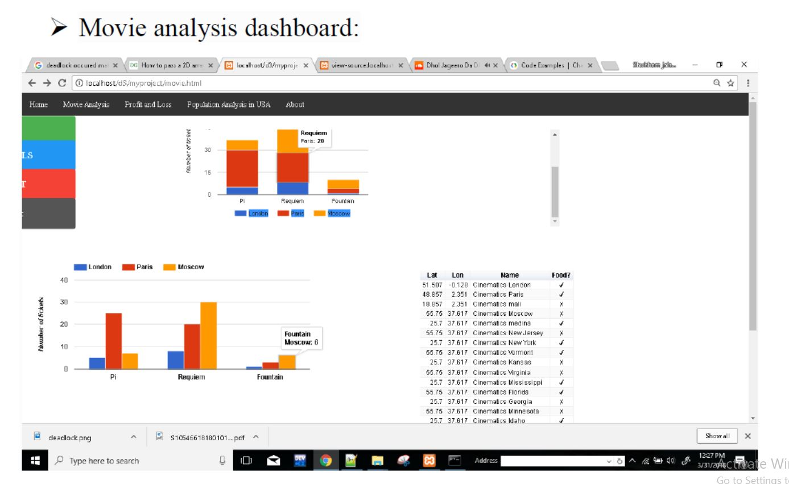
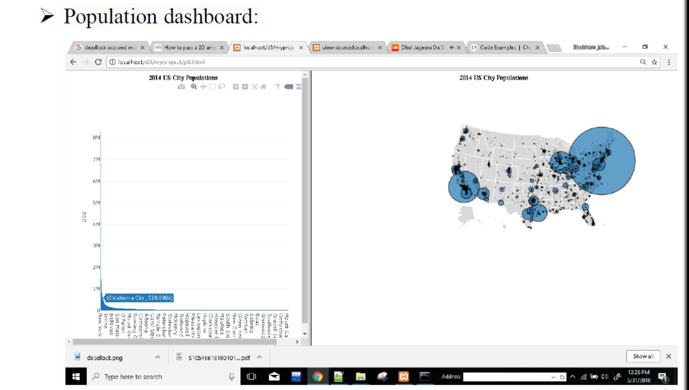
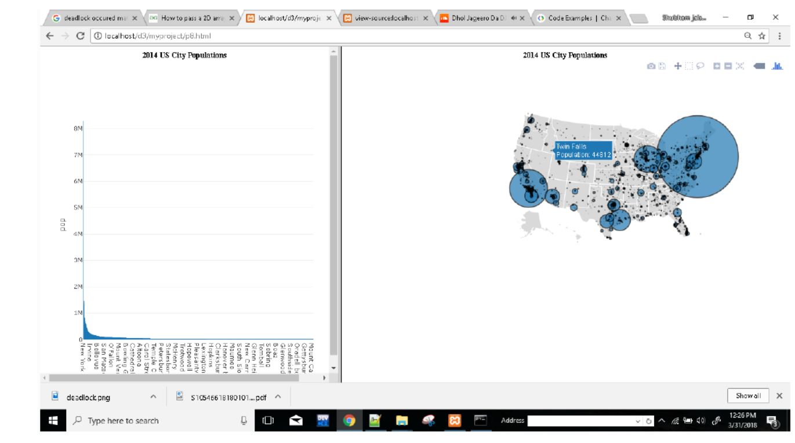

# Dashboard 
Dashboards are basically great places where you can pin whatever you want and organize the whole thing however you like (with sections, titles and so on). And by whatever you want what I really mean is maps, interactive graphs, forms, datasets previews and so much more.
Dashboards not only allow business-oriented users to understand what is actually behind that huge amount of data by displaying graphs, tables and so on, but they also enable them to play with data and to easily extract what they need from it.
 
# Multiple_Dashboard 
I have taken multiple datasets and I have accordingly design the dashboard. I have taken Company sales dataset, Movie Analysis dataset and Population of US dataset in order to visualize. I have tried to visualize the data in best possible way.

 
<h1> Company sale dataset:</h1> 
In this dataset, I have created a dashboard which contains performance of the company. In that, it consists of sales, expenses and profit of the different companies in year 2012. I have used bar chart in order to visualize and compare between the companies. I have used different colours in order to represent company’s sales, expenses and profits. I have plotted a histogram to represent overall sales breakdown of the companies. I have used line graph to visualize the performance of the companies. Each and every company have share holders and I have drawn a pie chart to show their shares in the particular company.
 
<h1> Movie analysis dataset:</h1> 
In this dataset, I have designed the dashboard which contains movie halls having tickets in three different city, London, Paris and Moscow , using a bar graph. I have also visualized it using histogram.
 
<h1> Population of US dataset: </h1> 
In this dataset, the dashboard created contains map of US consisting of all the states there and their population. The state population has been shown by using the size i.e the state having larger area has been shown
using large circle. I have also used a continuous graph in order to show the population corresponding to each state.
 
<h1>In order to visualize the data, I have used:</h1> 
<h2> API: Google chart</h2> 
Google Charts provides a perfect way to visualize data. From simple line charts to complex hierarchical tree maps, the chart gallery provides a large number of ready-to-use chart types. The most common way to use Google Charts is with simple JavaScript that I have used in order to embed in our web page. I loaded some Google Chart libraries, list the data to be charted, select options to customize the chart, and finally created a chart object with an id. Then, later in the web page, I created a 
 with that id to display the Google Chart.
   
  
<h1> D3.js </h1>
D3 (Data-Driven Documents or D3.js) is a JavaScript library for visualizing data using web standards. D3 helps us bring data to life using SVG, Canvas and HTML. D3 combines powerful visualization and interaction techniques with a data-driven approach to DOM manipulation, giving the full capabilities of modern browsers and the freedom to design the right visual interface for our data.

<h1> Screenshots:</h1>
<h2>Company sale dashboard:</h2>
 
 
<h2> Movie Analysis dashboard:</h2>
 
<h2>Population dashboard:</h2>
 
 
